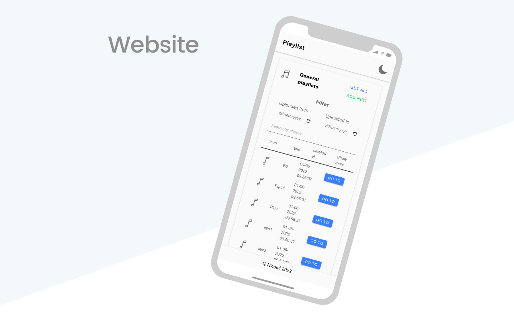

## Playlist web application

Meet the Playlist and keep songs in one place. The list management platform lets you to upload your songs to the global system and update them.

You can review the songs in a form of the list. We suggest you to filter the songs by phrase or a date of their creation.

## Demo

https://playlist.m-prus.uk/


## Technical Specification

- A README file with setup instructions.
- Good testing practices (server).

- A git repository with clean commit history.
- Good REST practices.
- Async and Error handling (custom error response).


## Usage

1. Application is connected to PostgreSQL database. Find the latest version of PotgreSQL from the official website https://www.postgresql.org/download/
To initialize the PostgreSQL on your computer set up your access password during the installation and keep a default the other options.

2. Rename "config/config.env.env" to "config/config.env" and update environment settings to your own *. 

.* (Include only your db password, if you are using a default local configuration).

3. Access db command line (optional)

```
psql postgres postgres
```

## Install dependencies


```
# Run to change directory to client

cd client
```

```
# Run this command in both server and client directories.

npm install

npm install react-scripts
```

```
# Run this command in ./client to build the client project.

npm run build
```

```
# Run to change directory to server

cd ../server
```

```
# Run to initialize the playlist database

npx sequelize-cli db:create
```

```
# Run to initialize the tasks table

npx sequelize-cli db:migrate
```


## Run App in development environment
```
npm run dev
```

## Run unit tests

Run Server-side tests
```
npm run test
```


## Installation Missing?

If some scenario is not covered, please let me know by email.

- Version prequire 1.0.0
- License MIT

created by mikey.prus@gmail.com

---

<p align="center"></p>